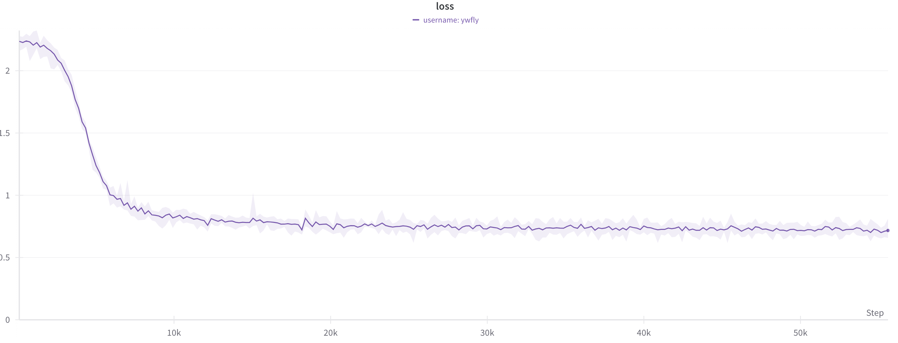
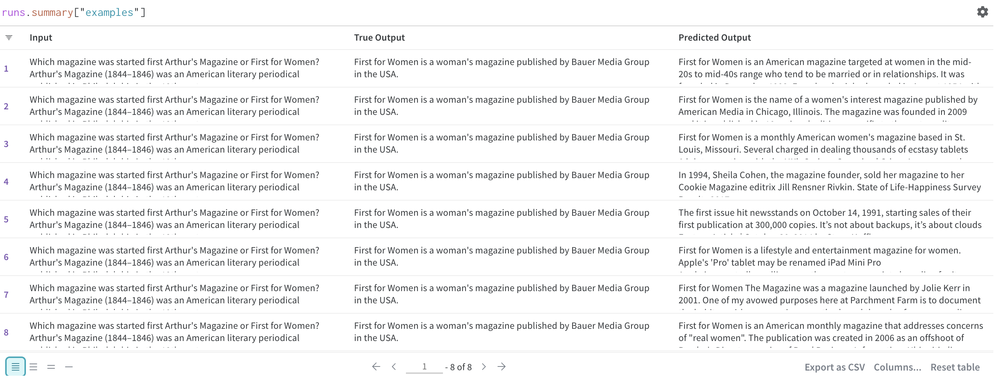

# KG-LLM-Doc - LLaMA(2)
This repository includes the code for instruction-fine-tuning LLaMA(2) for enhancing reasoning capability modified from [lit-llama](https://github.com/Lightning-AI/lit-llama)

## Pretrained Model checkpoints
Please refer instruction [here](https://github.com/Lightning-AI/lit-llama) for accessing pre-trained checkpoints of LLaMA(2). After you have them, please following instruction [here](https://github.com/Lightning-AI/lit-llama/blob/main/howto/download_weights.md) to transform the model weight to the model checkpoint. 

> [!important]  
Note that we also provide the model checkpoints after the download and process in the checkpoints.zip in [Dropbox](https://www.dropbox.com/scl/fo/y9ydmvv0bj846klkfdin0/h?rlkey=epyzclz2kbcf2g4iuz0tojlm9&dl=0). Please only use it after you obtain the permission [here](https://ai.meta.com/llama/)


## Instruction Fine-tuning LLaMA(2)
* **Configure Environment**
```
conda create env -f llama2.yml
```
* **Fine-Tuning**: the default hyperparameter requires A100(40G) for training, please modify adaptively. Note we use wandb to log the training process, see instructions using wandb [here](https://docs.wandb.ai/quickstart)
```
python3 finetune/ft_lora.py
```
Your loss landscape should be something like this after fine-tuning.

Here we show the reasoning inference performed by LLaMA2 on one example along the training process:

Note that you could either fine-tune LLaMA or LLaMA2, we provide the fine-tuned Lora-weight and the original pre-trained Lora-weight for both of them in [Dropbox](https://www.dropbox.com/scl/fo/y9ydmvv0bj846klkfdin0/h?rlkey=epyzclz2kbcf2g4iuz0tojlm9&dl=0)
* For **LLaMA**, change hyperparameters in finetune/ft_lora.py:
```
pretrained_path = f"checkpoints/lit-llama/{size}/lit-llama.pth"
tokenizer_path = "checkpoints/lit-llama/tokenizer.model"
run = wandb.init(project = f'lora_ft_llama-{size}_{dataset}')
```
* For **LLaMA2**:
```
pretrained_path = f"checkpoints/lit-llama2/{size}/lit-llama2.pth"
tokenizer_path = "checkpoints/lit-llama2/tokenizer.model"
run = wandb.init(project = f'lora_ft_llama2-{size}_{dataset}')
```


* **API-Inference**: Graph Traversal Agent/Reasoning
Before running the inference API, please double check whether you already have (note that in my running for LLaMA2, I didn't finish the whole training process so I use .ckpt at certain training epoch):
* For **LLaMA**:
```
lora_path: Path = Path("out/lora/reason/7B/lit-llama-lora-finetuned.pth"),
pretrained_path: Path = Path("checkpoints/lit-llama/7B/lit-llama.pth"),
tokenizer_path: Path = Path("checkpoints/lit-llama/tokenizer.model"),
```
* For **LLaMA2**:
```
lora_path: Path = Path("out/lora/reason/7B/iter-51199-ckpt.pth"),
pretrained_path: Path = Path("checkpoints/lit-llama2/7B/lit-llama2.pth"),
tokenizer_path: Path = Path("checkpoints/lit-llama2/tokenizer.model"),
```
Then run
```
python3 generate/lora_api.py
```


## Data
reason_instruction.json: we rearange the training data from HotpotQA and MuSiQue and organize as the following format, e.g.,:
* **Instruction**: What evidence do we need to answer the question given the current evidence?
* **Input**: Which magazine was started first Arthur's Magazine or First for Women?\nArthur's Magazine (1844–1846) was an American literary periodical published in Philadelphia in the 19th century.
* **Output**: First for Women is a woman's magazine published by Bauer Media Group in the USA.

## To double-check whether you have all files ready, the tree structure of the whole folder:
```
.
├── checkpoints
│   ├── lit-llama
│   │   ├── 7B
│   │   │   └── lit-llama.pth
│   │   ├── tokenizer.model
│   │   └── tokenizer_checklist.chk
│   ├── lit-llama2
│   │   ├── 7B
│   │   │   └── lit-llama2.pth
│   │   ├── tokenizer.model
│   │   └── tokenizer_checklist.chk
│   └── llama2
│       ├── 7B
│       │   ├── checklist.chk
│       │   ├── consolidated.00.pth
│       │   └── params.json
│       ├── 7B-chat
│       │   ├── checklist.chk
│       │   ├── consolidated.00.pth
│       │   └── params.json
│       ├── tokenizer.model
│       └── tokenizer_checklist.chk
├── core
│   ├── __init__.py
│   ├── adapter.py
│   ├── adapter_v2.py
│   ├── lora.py
│   ├── model.py
│   ├── packed_dataset.py
│   ├── quantization.py
│   ├── tokenizer.py
│   └── utils.py
├── data
│   └── reason
│       ├── reason_instruction.json
│       ├── train.pt
│       └── val.pt
├── finetune
│   ├── adapter.py
│   ├── adapter_v2.py
│   ├── ft_lora.py
│   └── full.py
├── generate
│   ├── adapter.py
│   ├── adapter_v2.py
│   ├── full.py
│   ├── inf.py
│   └── lora_api_6000.py
├── llama2.yml
├── out
│   └── lora
│       └── reason
│           └── 7B
│               ├── iter-12799-ckpt.pth
│               ├── iter-25599-ckpt.pth
│               ├── iter-38399-ckpt.pth
│               ├── iter-51199-ckpt.pth
│               └── lit-llama-lora-finetuned.pth
├── requirements.txt
├── run_convert.sh
└── scripts
    ├── convert_checkpoint.py
    ├── convert_hf_checkpoint.py
    ├── convert_lora_weights.py
    ├── download.py
    ├── prepare_alpaca.py
    ├── prepare_col.py
    └── prepare_reason.py
```
  
